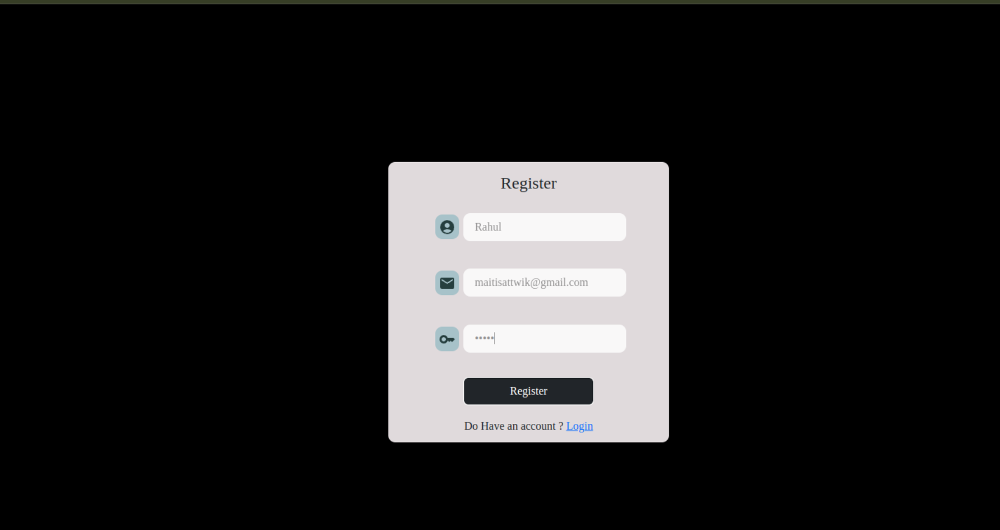
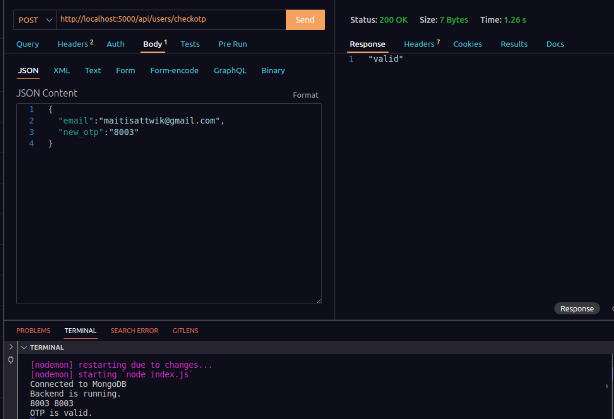
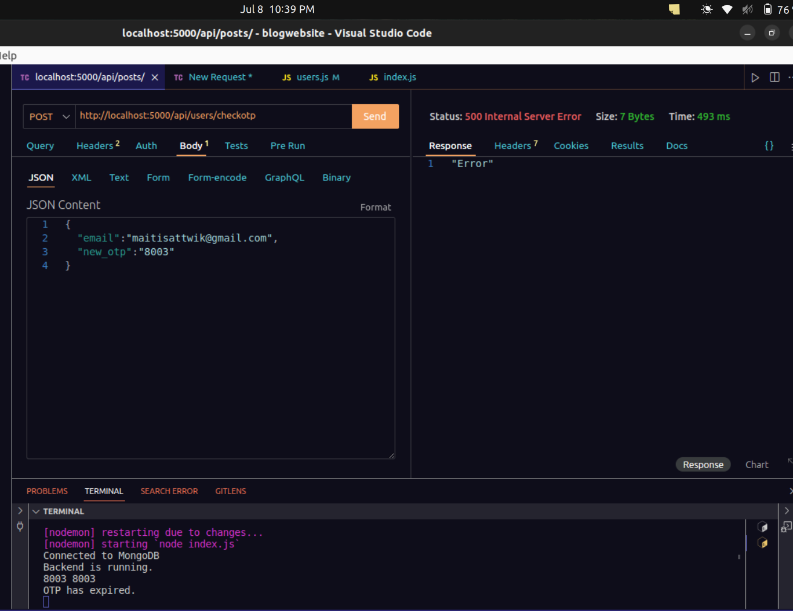
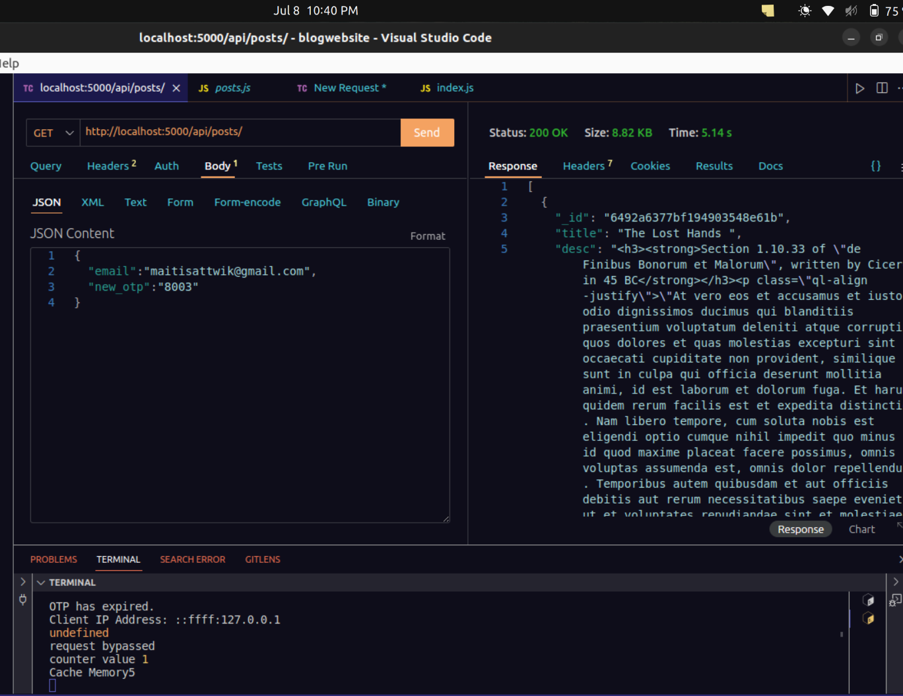
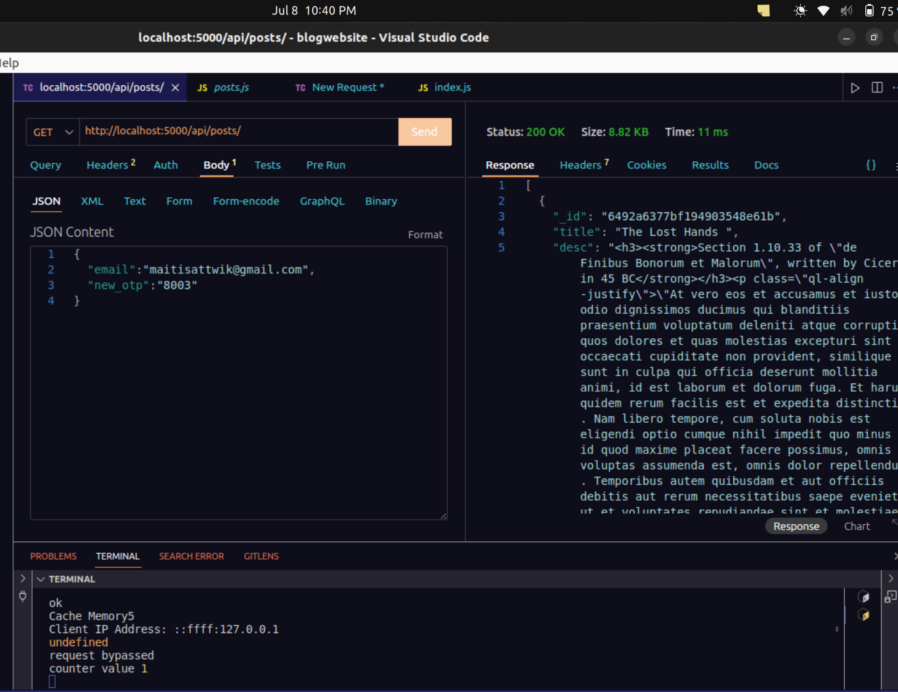
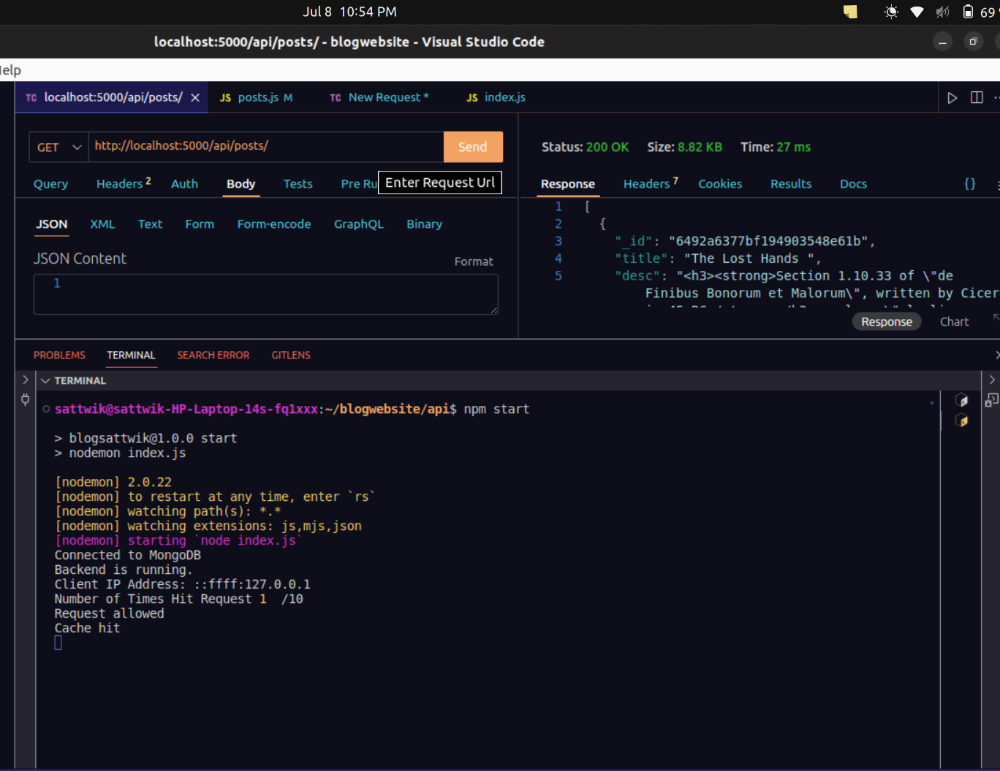
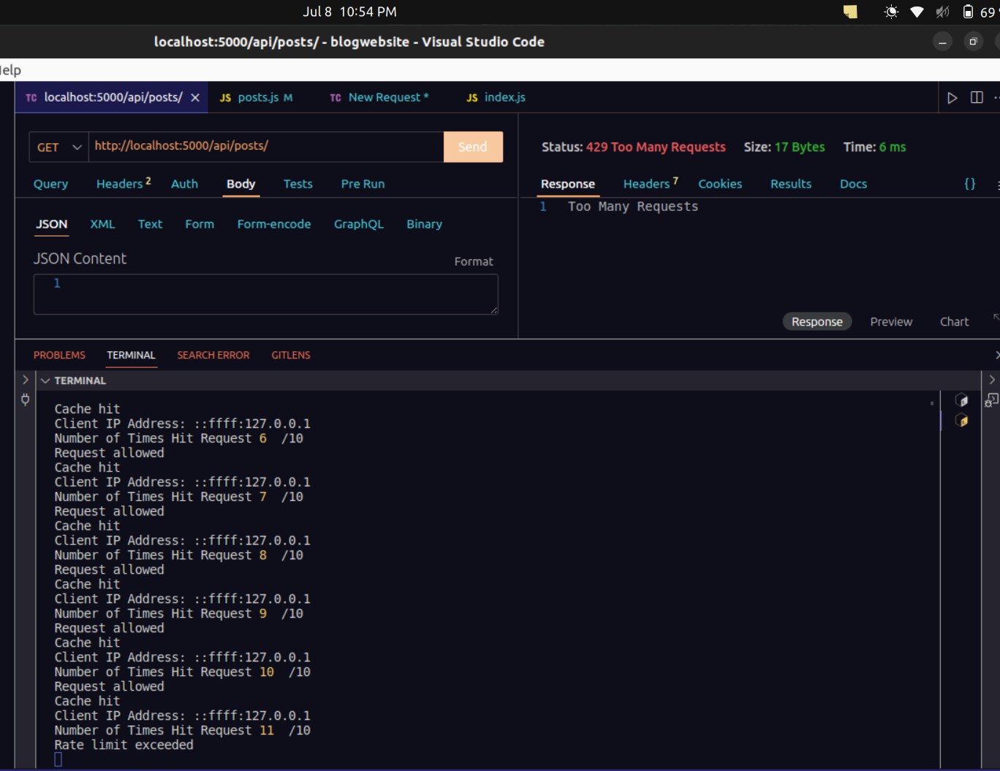
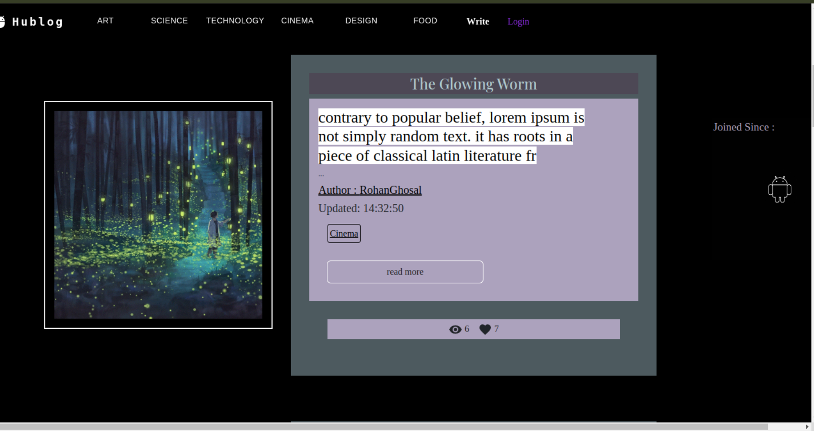
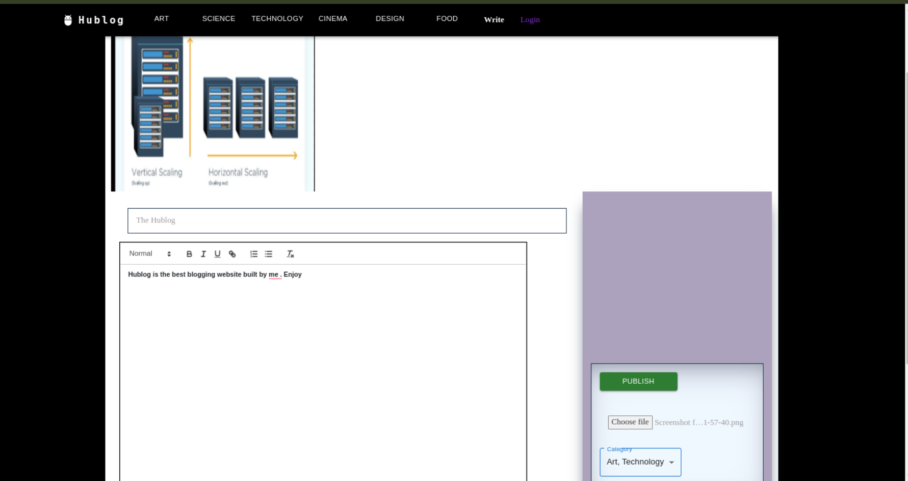
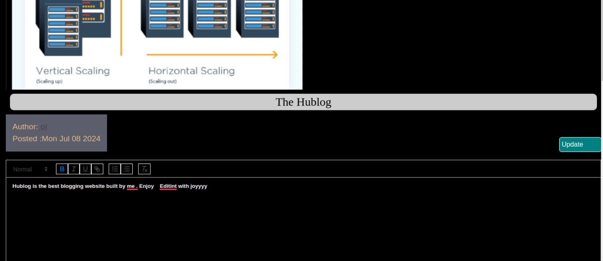

# Description 

>1. # Register Page  : Note email : maitisattwil@gmail.com

>2. # Otp send to the above maitisattwik@gmail.com  (at 10.33 pm )

>3. # Otp submitted within 5 minutes and accepted 

>4. # Otp submitted at 10.39 pm , so otp becomes invalid

>5. # Redis / Cache MISS when first time fetched data {see Fetched time : 5.14s}

>6. # Redis / Cache HIT , when tried to fetch again ( see Fetched Time : 11ms)

>7. # Rate Limiting - Client Ip address noted by Redis when first time cache HIT (Max Request Allowed with 20 sec : 10 tiems)

>8. # Rate limiting exceeded . 10 times requested  (Terminal counter value : 11/10 )

>9. # Home page 

>10. # Single Blog Page

>11. # Write Page 

>12. # Update Blog

